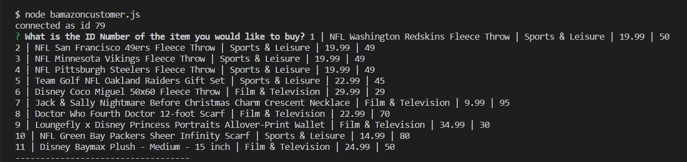
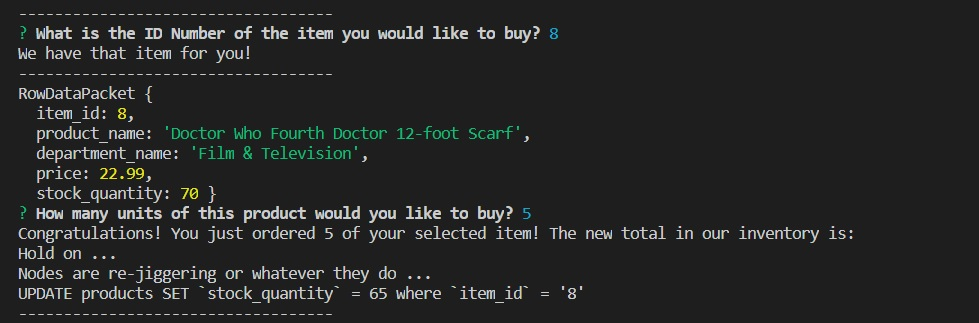
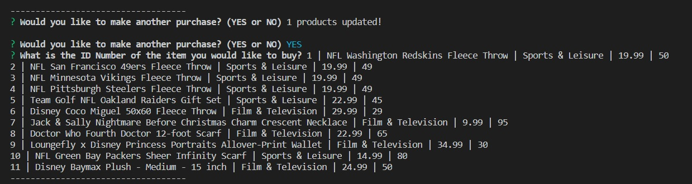
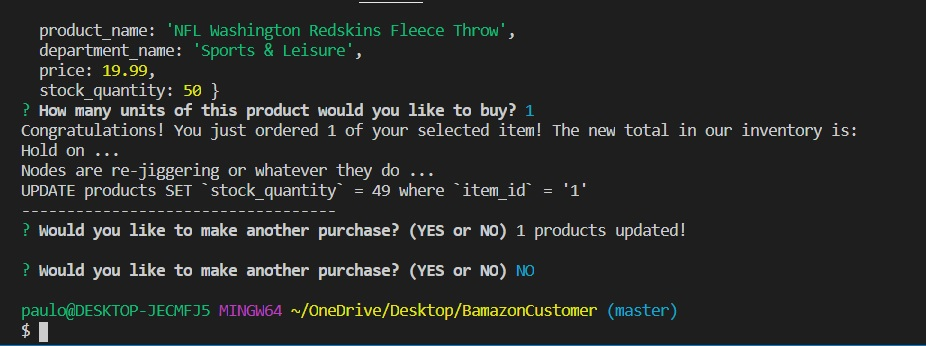

# BamazonCustomer
Let's try the easiest assignment and see where we get...
--------------------------------------------------------------------
This program is meant to simulate, through the wonders of Node.JS and the magic of SQL, a popular shopping website (*wink-wink*) that allows customers to buy select items through its programming. 

In this program, you are the customer on Bamazon -- the hip new (fictional) online marketplace that is in no way Copyright Infringement on a certain Jeff Bezos-owned mega-corporation. You will be able to "buy" from a relatively short inventory of items, and see how your purchases affect the inventory. In order to do this, you will control the program through the Bash Terminal. 

INSTRUCTIONS: 

1. Access the program through the Bash Terminal by typing command `node BamazonCustomer.js` and hitting `Enter`.

2. You will see a prompt of 11 items you will be able to 'purchase' through the terminal, with the question: `What is the ID number of the item you would like to buy?`

    * The ID number is the corresponding number on the leftmost side of the item description. Type the number of the product you want to purchase, then press `Enter`.

    * You will receive an error message (`ID Number does not exist! Try again`) if the ID number you refer to is not within the parameters of the 11 items currently listed. 

    * Otherwise, you will receive a confirmation message (`We have that item for you!`), and you will move on to the next step.

3. Bamazon will show you a rudimentary description of the item in question, including the quantity of the item in stock. The "stock_quantity" is the limit of the specific item that you can purchase. From there, Bamazon will ask you the following: `How many units of this product would you like to buy?`

    * If you ask for a quantity over that limit, you will receive an error message (`Okay, Mr. Moneybags, calm down - we don't have THAT many of what you want. Try again:`). 

    * Similarly, you will receive an error message if you, for whatever reason, ask for zero items (`Ha ha ha, then why are you here? Try again:`).

    * Otherwise, you will receive a confirmation message on the number of items you purchased, and you will get an updated stock quantity. 

4. Afterwards, you will be asked if you would like to make another purchase. If you type `YES`, you will be taken back to the Bamazon Inventory, to make another selection -- and you will see the updated Bamazon inventory, complete with the new totals for the items you have previously purchased. If you type `NO`, your Bamazon experience ends ... forever. 

(Or until you initialize the program again -- either/or.)

